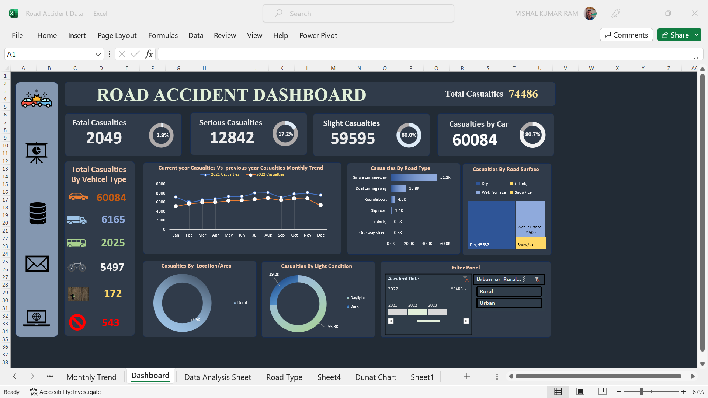
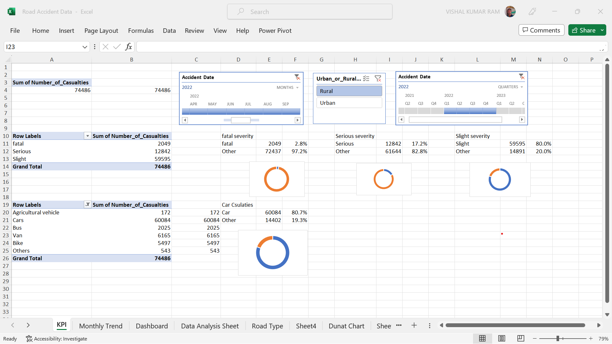
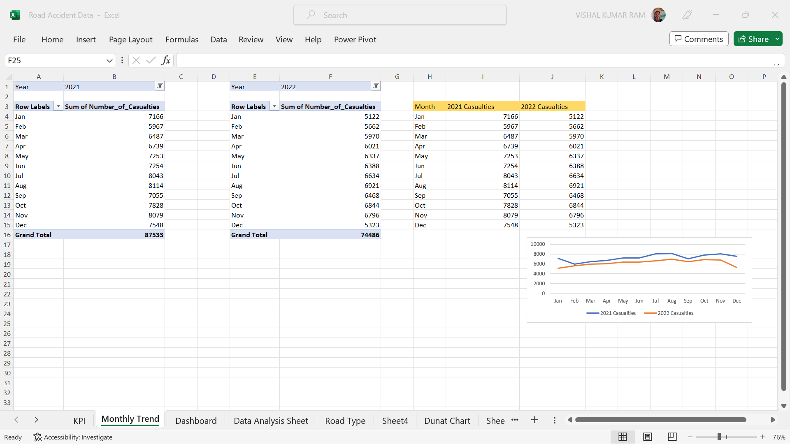
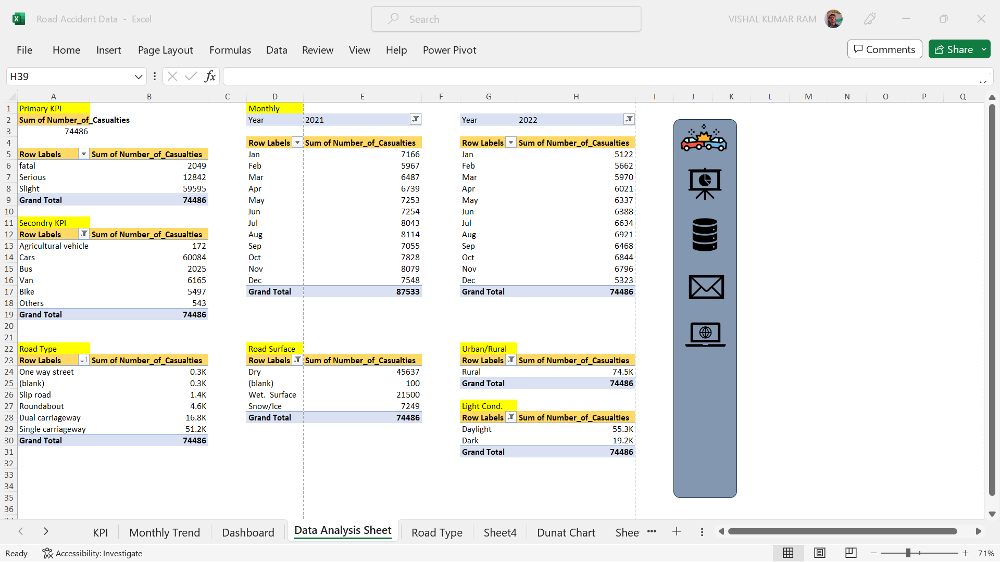
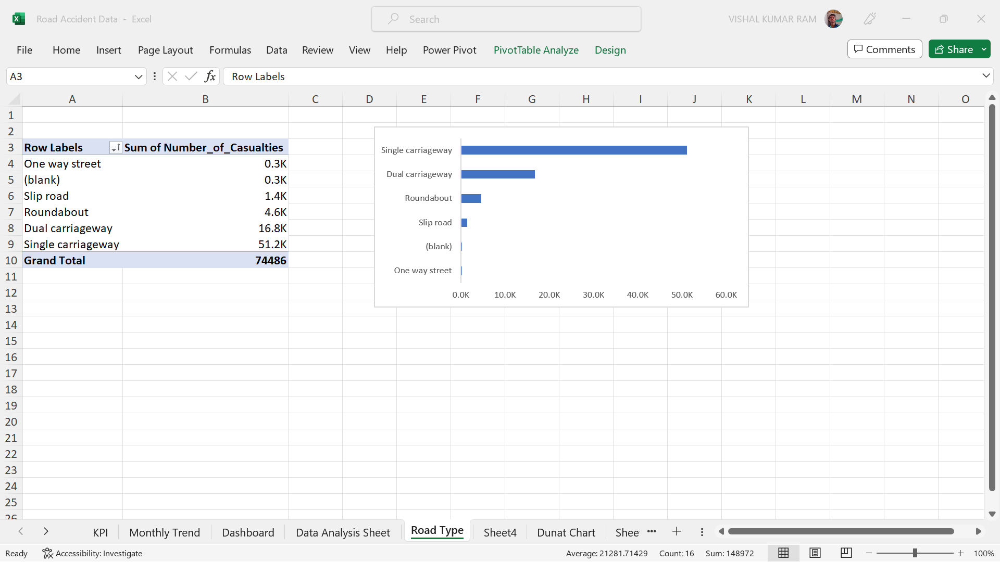
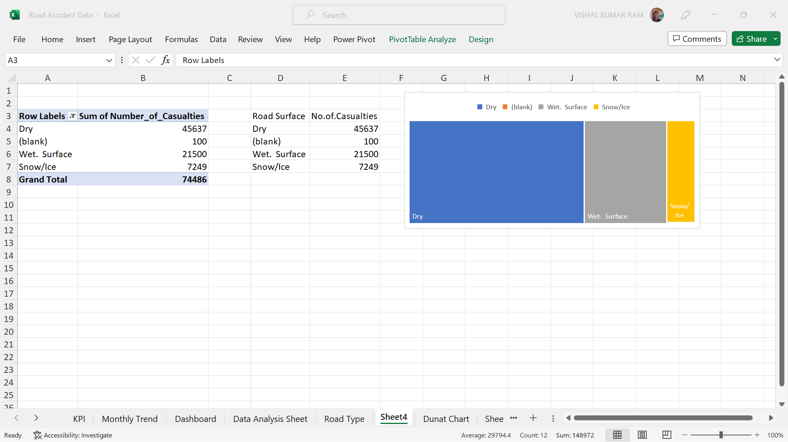
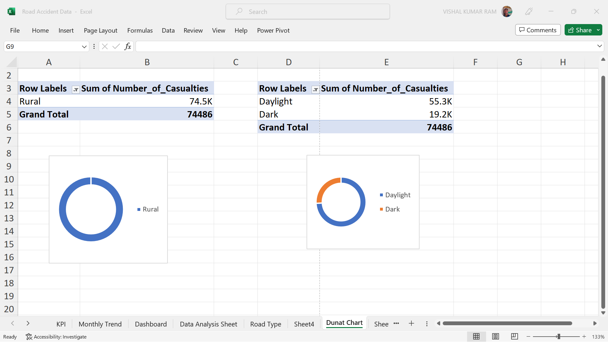

# Road Accident Dashboard Project

This project is a Road Accident Dashboard that provides insights and visualizations based on road accident data. It aims to help stakeholders understand accident trends, analyze key performance indicators, and make data-driven decisions to improve road safety.

## Table of Contents

1. [Introduction](#introduction)
2. [Features](#features)
3. [Screenshots](#screenshots)
4. [Getting Started](#getting-started)
5. [Usage](#usage)
6. [Dependencies](#dependencies)
7. [Contributing](#contributing)

## Introduction

The Road Accident Dashboard project is built to analyze and visualize road accident data collected over time. The dashboard provides an overview of important KPIs, monthly trends, road types, and more, making it easier for users to gain insights into accident patterns.

## Features

- KPI visualization: Overview of key performance indicators related to road accidents.
- Monthly trend analysis: Visual representation of accidents over different months.
- Data analysis sheet: Detailed data analysis in tabular format.
- Road type insights: Visualization of accidents categorized by road type.
- Dunat chart: A unique chart to showcase accident data distribution.

## Screenshots

## Getting Started

To get started with the Road Accident Dashboard project, follow these steps:

1. Clone the repository: `git clone https://github.com/vishalkumar32/Road-Accident-Dashboard`
2. Navigate to the project directory: `cd Road-Accident-Dashboard`
3. Open the Excel file containing the dashboard.

## Usage

The Excel file contains multiple sheets, each providing different visualizations and insights. Simply open the file to access the dashboard. The visualizations are dynamic and will update based on the data present in the underlying data source.

## Dependencies

This project relies on the following software:

- Microsoft Excel (Version X.X.X): The dashboard is designed and tested on Microsoft Excel. Compatibility with other spreadsheet software is not guaranteed.

## Contributing

Contributions to this project are welcome and encouraged. If you find any issues or have suggestions for improvements, please create an issue or submit a pull request. We appreciate your feedback!

1. Fork the repository.
2. Create your branch: `git checkout -b feature/new-feature`.
3. Commit your changes: `git commit -m 'Add new feature'`.
4. Push to the branch: `git push origin feature/new-feature`.
5. Open a pull request.

## Thank You
